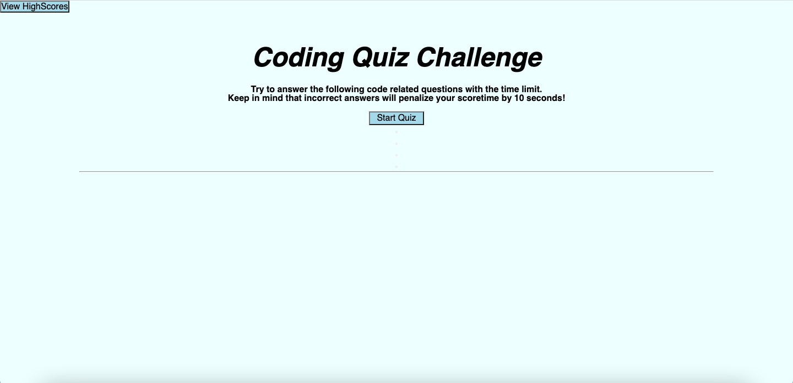
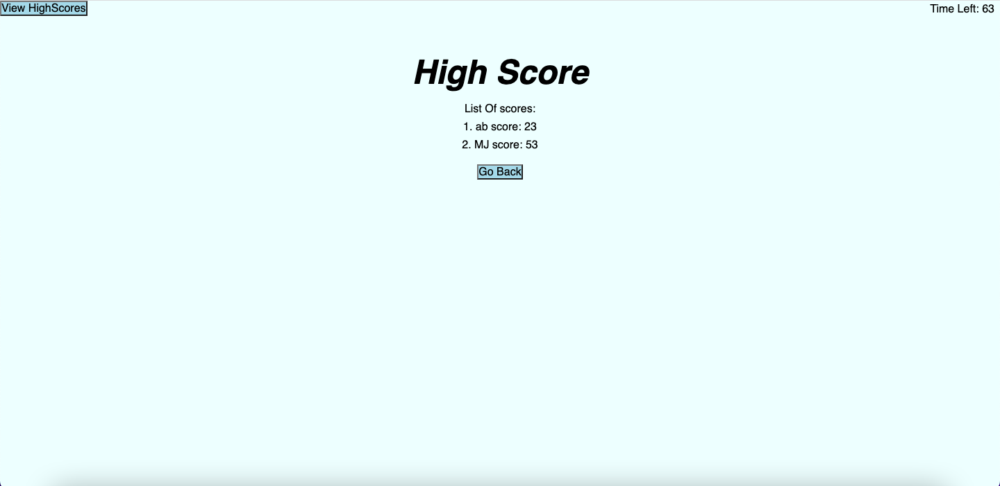

# Coding-Quiz
This is a timed coding quiz written using HTML, CSS, and Javascript. This application uses Javascript to provide quiz questions and collect answer from user to determine whether the answer is correct and then generates a score and appends a final page of results from the user data.

## Acceptance Criteria
The completed application should meet the following criteria:  
WHEN I click the start button  
THEN a timer starts and I am presented with a question  
WHEN I answer a question  
THEN I am presented with another question  
WHEN I answer a question incorrectly  
THEN time is subtracted from the clock  
WHEN all questions are answered or the timer reaches 0  
THEN the game is over  
WHEN the game is over  
THEN I can save my initials and my score  

## Technology used
- HTML
- CSS
- Javascript

## Screenshots

### Start Quiz Section

### High Score Section

## Deployment URL
https://17keerti.github.io/Coding-Quiz/